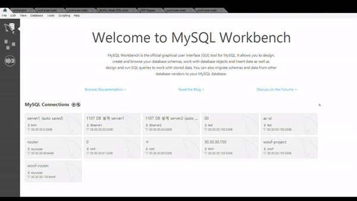

<h1 align="center">
반려동물 케어 서비스  

Woof </h1>


> [플레이 데이터] 한화시스템 BEYOND SW캠프 / Woof


🎬[Demo 시연영상](https://www.youtube.com/watch?v=dhMrKTwNI8U&lc=UgzCJR3WxkvsckRyyO94AaABAg&ab_channel=%EB%94%B0%EB%9D%BC%ED%95%98%EB%A9%B4%EC%84%9C%EB%B0%B0%EC%9A%B0%EB%8A%94IT)   
📃[프로젝트 회고록](블로그주소)

## ✨ 프로젝트 설명

```sh
반려동물 시장과 1인 가구의 규모가 점점 커지면서 유치원 같은 일일 보호 서비스가 많아지고 있다.
하지만 1인 가구에서 시간을 내어 이동하고 맡기고 데리고 오고 하는 것은 제약이 크다.
Woof는 사용자 주변 반려동물 업체에 대한 정보를 제공하고 예약 및 1:1맞춤 케어, 픽업 서비스를 제공하고자 한다.
```

## 📌 프로젝트 목표

```sh
Centos 8, Mysql(InnoDB)를 이용하여 설계를 통한 ERD 작성 및 구현
고객의 개인 정보와 실시간 정보가 추적이 돼야 하고,
검색기능 사용 기대값이 높기 때문에 모든 DB서버에 RW권한을 부여한 Cluster server 사용
```

## 🖼️ 프로젝트 구현

ERD
------------


릴레이션 스키마
------------


시스템 아키텍처
-------------

```sh
쓰기 기능의 사용량이 많을 것으로 생각되어 모든 서버에 읽기, 쓰기 권한을 부여하고자 한다.
```

multi-primary를 활용한 cluster 서버
-----------------------------------------


<서버 닫고열고 해보고 하는 움짤>
우리꺼로 바꾸기

## 🙂팀원

**👽️강문혜**

**✨강지흔**

**🚀이창훈**

**💚임연진**

