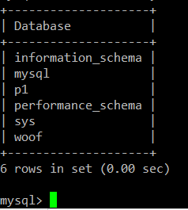

<h1 align="center">
반려동물 케어 서비스

Woof </h1>


> [플레이 데이터] 한화시스템 BEYOND SW캠프 / Woof


## ✨ 프로젝트 설명

```sh
반려동물 시장과 1인 가구의 규모가 점점 커지면서 유치원 같은 일일 보호 서비스가 많아지고 있다.
하지만 1인 가구에서 시간을 내어 이동하고 맡기고 데리고 오고 하는 것은 제약이 크다.
Woof는 사용자 주변 반려동물 업체에 대한 정보를 제공하고 예약 및 1:1맞춤 케어, 픽업 서비스를 제공하고자 한다.
```

## 📌 프로젝트 목표

```sh
Centos 8, Mysql(woofDB)를 이용하여 설계를 통한 ERD 작성 및 구현했다.
고객의 개인 정보와 실시간 정보가 추적이 돼야 한다.
쓰기 작업이 가능한 Master 서버와 읽기 작업만 가능한 Slave 서버를 구성하여 부하를 분산시켰다.

```

## 🖼️ 프로젝트 구현


```sh
[한 화면에 모든 자료가 담기지 않아 각각의 사진으로 대체]

마스터에 p1을 추가한다
```


```sh
마스터에서 추가한 p1을 슬레이브에서 확인해본다
슬레이브 상태를 같이 출력함
```

ERD
------------


릴레이션 스키마
------------

```sh
상세보기 

테이블 - [ 업체 ] 
속성 - 업체 ID/ 비밀번호/ E-mail/ 사업자등록증/ 전화번호/ 주소/ 업체타입/ 이름테이블 - [ REVIEW ] 
속성 - 리뷰 번호/ 별점/ 사진/ 댓글/ 댓글 시간/ 예약 번호테이블 - [ WOOF_MANAGER ] 
속성 - 사원번호/ 성별/ 경력/ 전화 번호테이블 - [ 고객 ] 
속성 - 고객ID/ 비밀번호/ E-mail/ 주민등록번호/ 전화번호관계 - < 보호 > 
관계 - < 예약 >테이블 - [ 반려동물 ] 
속성 - 식별번호/ 종/ 나이/ 성별/ 질병/ 몸무게/ 성격/ 고객 ID관계 - < 예약 > 
속성 - 예약 번호/ 시간/ 장소/ 예약 상태/ 업체 ID/ 고객 ID / 예약번호 
```

시스템 아키텍처
-------------
-------------
<h3>Master-Slave 서버란?</h3> <br>
데이터베이스 시스템에서 주로 사용되는 <b>데이터 복제(replication)</b> 방식 중 하나
-------------


```sh
쓰기 작업이 가능한 Master 서버와 읽기 작업만 가능한 Slave 서버를 구성하여 부하를 분산시켰다.
```


## 🙂팀원

**👽️강문혜**

**✨강지흔**

**🚀이창훈**

**💚임연진**

